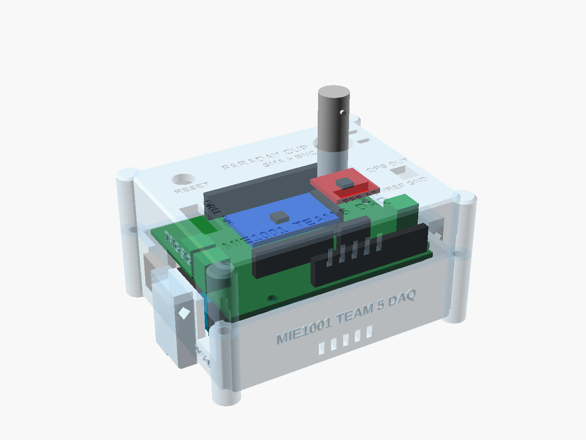
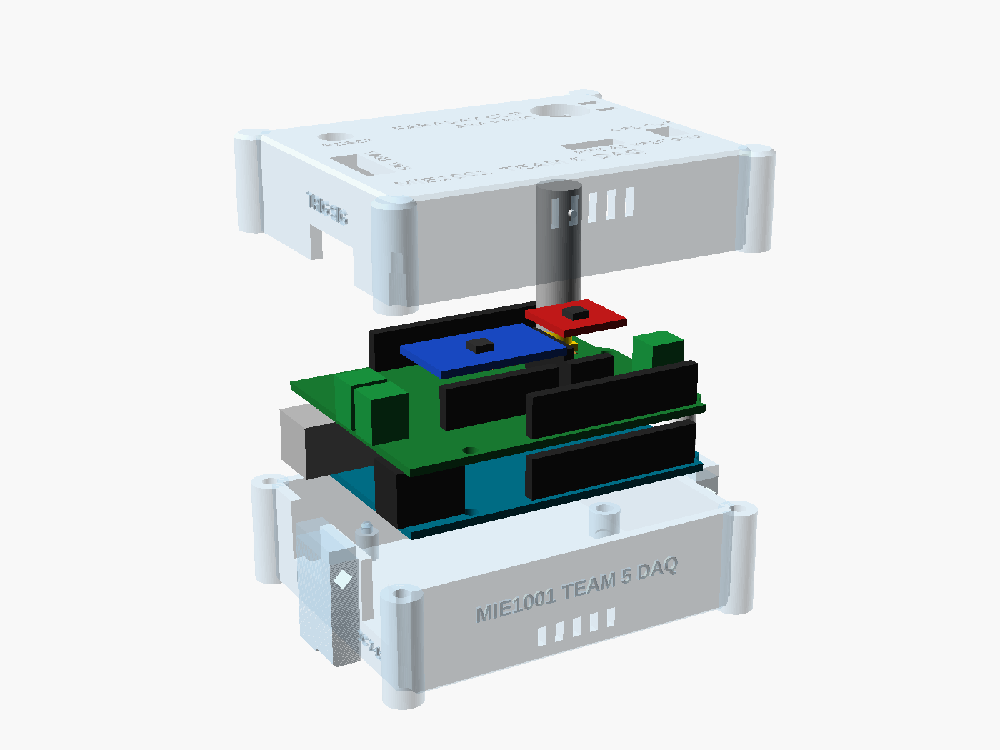

# MIE1001 Team 5 DAQ enclosure

A two-part, support-free enclosure in **transparent (recycled) PETG** for the Arduino UNO R3 (SMD CH340
clone) with the `mie1001_daq_simple` shield (rev D/E) stacked on it. You can see the UNO's LEDs (ON, L, TX,
RX) through the side walls, in the 11 mm gap between the UNO and the shield, and you can see the shield and
both breakouts through the lid.

| | |
|---|---|
| Outside (walls) | 77.4 × 61.1 × 41.5 mm (lid top 41.5 mm above the table) |
| Outside (incl. corner posts, cable-tie blocks) | 89.4 × 68.3 mm |
| Base / lid as printed | 89.4 × 68.3 × 24.7 mm / 84.6 × 68.3 × 19.5 mm |
| Filament, time (PrusaSlicer 2.9.6, 0.2 mm, 100 %) | base 37.5 g, 5 h 08 · lid 30.2 g, 4 h 02 · **total ≈ 68 g, 9 h 10** |

## Files

| Path | What |
|---|---|
| `scad/daq_enclosure.scad` | **The design.** All dimensions are parameters at the top of the file. `part = "assembly" / "exploded" / "base" / "lid" / "lid_print" / "spacer"` |
| `scad/pcb_positions.scad` | Connector positions, **generated** from the shield's `.kicad_pcb`. Don't edit it by hand |
| `stl/daq_base.stl` | Base tray, printing orientation (floor on the bed) |
| `stl/daq_lid.stl` | Lid, already flipped for printing (top face on the bed) |
| `stl/daq_spacer_x2.stl` | 2 spacers (Ø5.6 × 10.8 mm) between the UNO and the shield at holes H2/H3 |
| `print/petg_clear_0.2mm.ini` | PrusaSlicer settings (print + filament; the printer part is generic) |
| `renders/*.png` | assembly, assembly_back, exploded, boards_only, base, base_left, lid_top, lid_print |
| `build/fit_table.md` | Clearance table (generated by `tools/fit_check.py`) |
| `tools/dump_pcb.py`, `tools/make_positions.py` | KiCad board → JSON → `pcb_positions.scad`. They only read the board, from a snapshot copy |
| `build.sh` | Rebuilds everything: `./build.sh` (or `--no-pcb`, `--no-slice`) |

Tools: the OpenSCAD 2026.09.23 AppImage from files.openscad.org is in `~/Applications`. To edit, open the
`.scad` in OpenSCAD, change a parameter, press F5 (preview) or F6 (render), then **File › Export › STL**. Or run
`./build.sh`. PrusaSlicer is the flatpak `com.prusa3d.PrusaSlicer`. Its CLI runs without a display.

## How it goes together

- **Coordinates:** the origin is the UNO's lower-left corner, seen from the top as on the A000066 drawing.
  USB-B and DC are on the left, the power header is at the front, and the digital header is at the back.
  The parting plane is at z = 22.0, which is 1 mm above both jacks.
- **Base:** it has a 2.4 mm floor and 2.4 mm walls. The UNO sits 6 mm above the floor on 4 supports:
  - At **H2 (66.04, 7.62) and H3 (66.04, 35.56)**: Ø7 bosses with **M3 heat-set inserts** (M3 × 5.7, 4.0 mm hole).
  - At **(13.97, 2.54)** and **(15.24, 50.8)**: support pins with a locating peg. No screw goes there. An M3 head
    or spacer at the first would hit the DC-jack body (the A000066 drawing shows the hole partly under it), and at
    the second it would hit the SCL header pin.
  - The USB-B and DC jacks sit in **U-notches that are open at the top**, so the finished stack drops straight in.
    The lid wall closes them 1 mm above the jacks.
  - Low vent slots are in the front and back walls, and recesses on the underside take 4 × Ø10 mm rubber
    bumpers (the feet).
- **Stack:** two printed spacers go at H2/H3 between the UNO and the shield. Fix each with an **M3 × 20** screw
  from the shield top through the spacer and the UNO into the insert, so both boards are clamped. The shield's
  H1 gets no screw.
- **Lid:** fastened by 4 × **M3 × 30 countersunk** screws (ISO 10642). They go in **from underneath** through the
  corner posts of the base, into heat-set inserts in the lid posts, so the top stays clean and clear.
- **Wires J1 SIGNAL IN / J3 TRIG** (left) and **J2 QPS OUT** (right) leave through slots at the bottom edge of the lid
  wall, at the height of the terminal entries. Under each slot, a block on the outside of the base has a
  diamond-shaped tunnel for a **cable tie (≤ 4.8 mm)**. Lay the wires on the block and tie them down; this is the
  strain relief. Tighten the terminal screws from above through the **screwdriver windows** in the lid
  (2.5–3 mm blade).
- **J4** (PRE_OUT, A2, VREF, GND): a 12 × 4.5 mm slot above the socket takes 4 Dupont jumpers from above.
- **J5 Faraday cup:** `faraday_mode = "passthrough"` (default) gives a Ø12.5 hole, so the SMA-male → BNC-female
  adapter screwed onto J5 sticks up through the lid. Two slots next to the hole let you **cable-tie the BNC cable
  to the lid**, so a pull on the cable doesn't twist the SMA jack off the shield. `faraday_mode = "bulkhead"`
  gives a 9.7 mm D-hole (8.9 mm flat) for a BNC bulkhead jack in the lid, with a short SMA-male pigtail inside.
  That is more robust mechanically, but the extra cable adds capacitance and triboelectric noise at pA levels,
  so the direct adapter is the better choice electrically. Check the hole against your bulkhead's datasheet.
- **Reset:** the UNO's button is **under the shield** (true of every shield), so no hole can reach it. The lid has an
  optional Ø7 hole (`reset_button = true`) for a 6–7 mm panel push button (normally open). Wire it with two short
  wires to the **RESET** and **GND** legs of the stacking header between the boards. Without the button, opening
  the serial monitor or uploading resets the board anyway (DTR auto-reset of the CH340).
- **Labels:** raised on the walls (SIG, TRIG, QPS OUT, USB, DC 7-12V, MIE1001 TEAM 5 DAQ). On the lid top they are
  **engraved** (MIE1001 TEAM 5 DAQ, FARADAY CUP, SMA > BNC, PRE A2 VREF GND, QPS OUT, SIG, TRIG, RESET). The top is
  printed face-down, so raised text there would need supports.

Assembly order:
1. Press the inserts in with a soldering iron at ~230 °C.
2. Plug the shield onto the UNO with the spacers, then fit the 2 × M3 × 20 screws.
3. Drop the stack into the base.
4. Screw the SMA→BNC adapter onto J5 finger-tight, and wire the terminals.
5. Lower the lid over the adapter and fit the 4 × M3 × 30 screws from below.
6. Tie the cables down.

## Shielding: transparent PETG gives **zero** EMI shielding

The picoamp preamp (U3 LMP7721, R6 100 MΩ, the J5 input, all inside the VREF guard) picks up mains hum and
anything that moves nearby. Nothing of the enclosure comes within 16.5 mm of it, and no rib or post touches the
shield. If the zero reading is noisy with the beam off:

- Stick **copper tape (or aluminium foil tape with conductive adhesive) inside the lid ceiling, only over the
  preamp.** An engraved 0.4 mm outline on the underside of the lid top marks the patch: board x 26–63, y 36.5–52,
  about 37 × 15 mm. Cut the Ø12.5 hole out of it. The rest of the lid stays clear.
- **Ground it.** Let the tape touch the SMA adapter's body (its shell is GND through J5), or solder a thin wire from
  the tape to J4 pin 4 (GND). A floating patch can make the noise worse.
- The patch is removable: peel it off for demos.
- A patch on the lid only shields from above. For a full cage, add a second patch on the floor under the UNO,
  grounded to the same point, or wrap the whole unit in foil during measurements.

## Printing (transparent PETG, 0.4 mm nozzle)

| Setting | Value | Why |
|---|---|---|
| Orientation | base: floor down · lid: top face down (the STL is already flipped) | the smooth bed face is the clearest face |
| Supports | **none** | notches open at the parting plane, 45° countersinks, a diamond cable-tie tunnel, and vertical slots ≤ 1.8 mm wide |
| Layer height | 0.2 mm (first 0.2 mm) | |
| Walls | 6 perimeters (= the 2.4 mm walls) | a solid wall has no infill pattern showing through |
| Top/bottom | 12 solid layers (= the 2.4 mm floor and top) | |
| Infill | **100 %**, rectilinear/monotonic, lines aligned | the other way to get clarity is **0 % infill with enough perimeters/solid layers to fill everything**. Anything in between (gyroid, 20 %) looks milky |
| Extrusion | 1.03 flow, 0.45 mm width | slight over-extrusion squeezes out the air gaps between lines. Air gaps make a part cloudy |
| Temperature | 245 °C first layer, **250 °C** after (the top of the PETG range) | hotter = better fusion = clearer |
| Speeds | outer walls **15 mm/s**, inner walls 25, solid infill 30 | slow and steady = fewer bubbles |
| Fan | 15–30 % (off for 3 layers) | a strong fan freezes the lines apart |
| Bed | 80 °C, smooth PEI or glass | a textured sheet gives a frosted bottom face |
| Ironing | **off** | on PETG it smears and fogs the top |
| Filament | **dry it** (65 °C, 4–6 h). rPETG works the same way | wet PETG pops and makes bubbles |

The finished parts are "clear", not glass-like; slicing lines always show a little. For the lid top, the bed face
is the best face. If you want it clearer still, wet-sand with 800 → 2000 grit and polish, or wipe on a thin coat
of clear lacquer.

Hardware:
- 6 × M3 heat-set inserts (M3 × 5.7, Ø4.0 hole)
- 2 × M3 × 20 screws (for the stack)
- 4 × M3 × 30 countersunk screws (for the lid)
- 4 × Ø10 × 1 mm rubber bumpers
- cable ties ≤ 4.8 mm
- optional: a 6–7 mm panel push button
- optional: copper tape

## Fit check (`python3 tools/fit_check.py` → `build/fit_table.md`)

The shield positions come from the `.kicad_pcb` (snapshot of 2026-09-25, rev D/E, connectors frozen). The UNO
jacks come from the A000066 outline drawing. Every clearance is ≥ 1 mm except the one marked `tight`.

| Opening | Enclosure | Part | Clearance mm |
|---|---|---|---|
| USB-B notch, sides / bottom / top | y 31.1–45.1, z 9.0–22.0 | jack y 32.1–44.1, z 10.0–21.0 | 1.0 / 1.0 / 1.0 |
| USB-B reach | outer wall x −4.4 | jack front x −6.5 | sticks out 2.1: the plug mates fully |
| DC notch, sides / bottom / top | y 1.2–12.8, z 9.0–22.0 | jack y 2.4–11.6, z 10.0–21.0 | 1.2 / 1.0 / 1.0 |
| DC plug reach | outer wall x −4.4 | jack front x −1.6 | recessed 2.8: the plug body must be ≤ 11.6 mm across |
| J1 SIGNAL IN wire slot (left) | y 12.3–30.8, z 22.0–29.0 | entries y 15.4 / 18.9, z 26.5 | 1.6 (3 mm wire) / 1.0 |
| J3 TRIG wire slot (same slot) | " | entries y 24.2 / 27.7 | 1.6 / 1.0 |
| J2 QPS OUT wire slot (right) | y 11.4–21.1, z 22.0–29.0 | entries y 14.5 / 18.0 | 1.6 / 1.0 |
| J1/J3/J2 body vs lid wall | x −2.0 / 70.58 | body x −0.91 / 69.48 | 1.1 |
| Screw windows J1+J3 / J2 | 5.8 × 16.3 / 5.9 × 7.5 mm | 3 mm blade | ≥ 1.0 (7.3 mm deep) |
| J4 Dupont slot | x 41.7–53.8, y 12.3–16.8 | socket x 42.7–52.8, y 13.3–15.8 | 1.0 |
| J5 adapter hole Ø12.5 at (58.34, 43.54) | | SMA nut 9.2 across corners / BNC studs 11.6 | 1.65 / 0.45 (pass-through only) |
| Lid ceiling z 39.1 | | breakouts z 37.1 / headers z 31.1 | 2.0 / 8.0 |
| Boards vs walls | | x / y | 2.0 / 1.5 |
| Lid posts vs board corners | r 4.0 | | 1.3 |
| Bosses/pegs vs shield H1–H3 | | | 0.00 position error |
| H3 spacer vs UNO ICSP header | Ø5.6 | keep-out y ≤ 32.14 | **0.6 (tight)** to the keep-out, ~1 mm to the header |
| Preamp guard | | | nothing within 16.5 mm above, 6.7 mm to the back wall |

## Assumptions and open questions (measure your boards!)

1. **Jack heights on the clone** (`jack_h` = 11.0) and the **stack gap** (`stack_gap` = 11.0, the shield resting
   on the USB-B shell). Measure the UNO top → USB shell top, and the UNO top → shield underside, with the real
   stacking headers. `z_split` follows `jack_h` automatically.
2. **Jack positions on the clone:** USB y 38.1, 12.0 wide, sticks out 6.5 mm; DC y 7.0, 9.2 wide, sticks out
   1.6 mm, axis 6.4 mm above the UNO. These were scaled from the A000066 drawing, and clones can differ by
   ±0.5 mm. Set `usb_*` / `dc_*`.
3. **Parts under the UNO** near the two support pins (DC-jack solder tails next to (13.97, 2.54)). The pin boss is
   Ø5; make `peg_boss_d` smaller if it hits.
4. **Breakout height** `brk_h` = 14.5: 8.5 socket + 2.5 pin spacer + 1.6 PCB + parts. Both breakouts **lie flat**
   (component side up) on their pin headers (README of the shield, silkscreen outlines). If your header
   is longer, raise `brk_h`.
5. **Phoenix PT 1,5/2-3,5-H:** body height 9.2 (KiCad 3D model). The wire entry at 3.9 mm above the PCB and the
   screw position are assumed; the window covers the whole front of the block.
6. **SMA height** (`sma_h` = 10.2, Amphenol 132134) and the length of your SMA→BNC adapter. In
   passthrough mode the adapter must reach at least 17 mm above the shield. If a bulkhead is used, check the
   D-hole.
7. **J4 is 1 × 4** on the PCB (PRE_OUT, A2, VREF, GND), not 1 × 3 as in the brief. The slot fits 4 pins.
8. The UNO's LEDs are under the shield: see them from the side through the base walls, not from the top.
9. Print one test piece first: `part="base"` cropped to the left wall (jacks), or simply the spacers + a wall
   section. PETG shrink is small, but the 0.3 mm fits depend on your printer.
