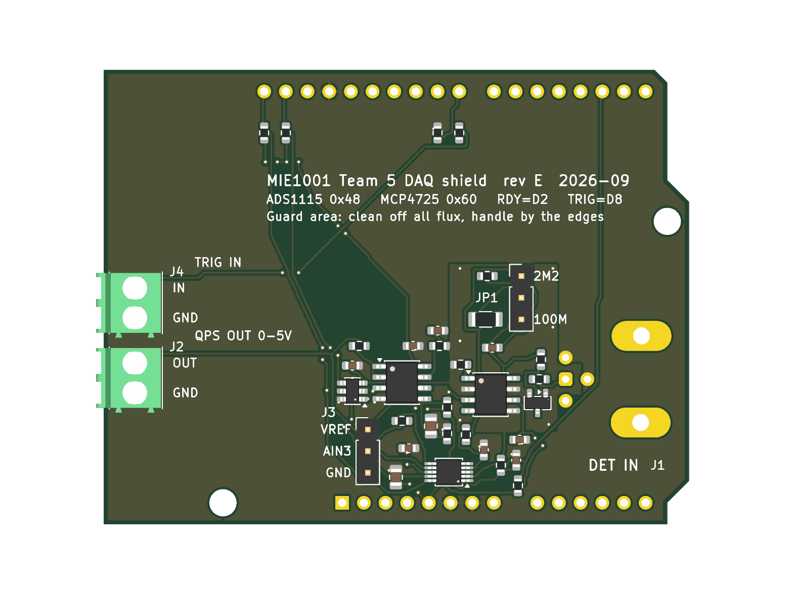

# MIE1001 Team 5 — DAQ shield for Arduino UNO R3 (rev E)

Data-acquisition shield for the portable quadrupole mass spectrometer. It measures the
detector current (pA to µA) with an electrometer transimpedance amplifier and a 16-bit
ADC, and drives the QPS mass command with a 12-bit DAC. It plugs onto an Arduino UNO R3
and takes all power from the UNO's 5 V rail.

```
detector -> J1 BNC -> R14 10k -> D1 clamp to VREF -> R4 1k -> U4 LMP7721 TIA (2M2 / 100M via JP1)
         -> R3/C2 1k/1uF anti-alias -> U2 ADS1115 AIN0 (AIN1 = VREF via R16/C10) -> I2C -> UNO -> USB
VREF: R7/R8 divider + C3 10uF -> U3B buffer -> R15 100R -> VREF + C9 1uF (-> R17 -> U4 IN+, guard, D1)
UNO -> I2C -> U1 MCP4725 -> U3A MCP6002 buffer -> R12 100R -> J2 -> Extrel QPS mass command
                                                          \-> R13 -> ADS1115 AIN2 (read-back)
Team 4 sequencer -> J4 -> R9/R10 -> UNO D8 (trigger)     U2 ALERT/RDY -> R11 pull-up -> UNO D2
```



## Status

| Check | Result |
|---|---|
| ERC (schematic) | 0 errors, 0 warnings |
| DRC (layout), incl. schematic parity | 0 errors, 0 unconnected, 0 parity issues |
| DRC warnings left | 4 × `lib_footprint_mismatch`: J1, J2, J4, A1 are deliberately modified copies (see *Layout*) |
| Guard check (`check_guard.py`) | 0 unexpected items: no copper of any other net within 1.0 mm of BNC_IN / DET_IN / TIA_IN / TIA_REF, except the BNC's own shell pins (0.98 mm, connector geometry). 22 input items have no VREF guard copper within 0.6 mm: R14.1 and the BNC centre-pin trace (squeezed between the BNC's pins), JP1.2, and 19 segments of the TIA_IN run from C1 to JP1. Those are bordered by the feedback nets (TIA_OUT, RF_100M), whose leakage only adds in parallel with the feedback resistor, not by +5 V or GND |
| Orientation | Matches a real UNO R3 seen from the top (rev D was mirrored, see below). **Still do the 1:1 paper check** |
| SMD parts | JLC assembles 31 parts (15 BOM lines). **R14 is hand-soldered** from the Digi-Key order (anti-surge, no verified LCSC stock). C15849 (1 µF, JLC *basic*) showed no stock on LCSC's shop on 2026-09-22 and the LMP7721 (C124427) only ~60 pcs: confirm both when ordering |

## Files

| File | What it is |
|---|---|
| `generate_schematic.py` | writes the schematic, symbol library and `BOM.csv` |
| `generate_pcb.py` | writes the PCB: placement, routing (built-in grid router), guard and ground pours |
| `check_guard.py` | leakage check around the pA input node |
| `make_fab.py` | JLCPCB BOM/CPL + gerber zip |
| `build.sh` | runs all of the above plus ERC, DRC and the exports |
| `mie1001_daq_board.kicad_pro/.kicad_sch/.kicad_pcb` | the KiCad 10 project (open the `.kicad_pro`) |
| `mie1001_daq_board.pdf` | schematic plot |
| `BOM.csv` | full BOM: manufacturer, MPN, Digi-Key P/N **and LCSC P/N** |
| `fab/mie1001_daq_shield_gerbers.zip` | gerbers + drill, upload this to JLCPCB |
| `fab/jlcpcb_bom.csv`, `fab/jlcpcb_cpl.csv` | JLCPCB assembly BOM and pick-and-place |
| `fab/assembly_top.pdf`, `fab/board_top.png` | assembly drawing and render |

**Both files are generated.** Edit the Python, then run `./build.sh`. Editing the
`.kicad_sch`/`.kicad_pcb` in the GUI works, but the next `./build.sh` overwrites it.

## What changed in rev E (independent critical review, 2026-09-22)

| Change | Why |
|---|---|
| **Board no longer mirrored** | KiCad's `Module:Arduino_UNO_R3` footprint is drawn from the back (kicad-footprints #864). Rev D used it as-is, so its headers, jacks and holes were a mirror image of a real UNO and the shield could not plug in. The footprint is now flipped and every coordinate goes through the corrected transform. The central block's *placement* was moved as one piece (a translation as seen from the top, so parts keep their positions relative to each other); all *routing* was redone and every check was re-run on rev E |
| **R14 10k anti-surge** (Panasonic ERJ-PA3F1002V, AEC-Q200, pulse-rated) between the BNC and the clamp | A discharge on the BNC went straight through D1 into VREF. R14 limits it; drop is 10 µV per nA. A plain thick-film 0603 was not rated for the pulse; a 1206 would not fit without crossing the input traces |
| **VREF buffered and decoupled**: R15 100 Ω + C9 1 µF, C3 100 nF → 10 µF | VREF had no capacitor and fed the LMP7721 IN+, AIN1 and the clamp directly; USB ripple passed the divider |
| **R17 1k into LMP7721 IN+**, **R16/C10 1k/1 µF into AIN1** | IN+ protection; AIN1 now sees the same 1k/1 µF as AIN0, so the ADC input offsets match |
| **LMP7721 pin 5 (N/C) on the guard** | It floated next to the input |
| Router keeps every other net ≥1.2 mm from the input nets | The review found the RDY track 0.23 mm from the BNC centre pin; `check_guard.py` now names every nearby item and fails on anything unexpected |
| Guard widened around IN+ and the BNC centre pin | Ground pour was 0.7–0.94 mm from input copper |
| Silkscreen ≥ 1.0 mm text | 0.8 mm was below the legible minimum |
| BNC mounting pegs stay unconnected | They are unnumbered pads with no schematic pin (netting them breaks the parity check); the shell is grounded through pins 2–4 |
| **Outline corner fixed** (second review) | The lower-right chamfer had been copied wrong since rev D: it now runs (38.1, 0) → (40.64, 2.54) like the UNO drawing |
| **Keep-outs** over the 328P ICSP header moved/enlarged, one added over the 16U2's ICSP1 header; keep-outs now respect a via's/track's full width; all vias tented | Second review: the ICSP keep-out was offset, and +5 V vias sat untented above ICSP1 |
| **JLCPCB rotations corrected** in `fab/jlcpcb_cpl.csv`: SOIC +270°, SOT-23/SOT-23-6 −90° (JLCKicadTools table) | Raw KiCad angles would place U1, U3, U4 and D1 90° off. **The MSOP (U2) has no known offset: check it in JLC's preview** |
| BNC and block moved 0.6 mm down, J1 label beside the BNC, guard stitching vias always placed (6) | BNC pegs clear the ICSP header; a stitching via could previously be skipped silently |

### Input bias: the one trade-off kept on purpose
The TIA holds its input at VREF = 2.5 V, while the BNC shell, the cable shield and the
vacuum chamber are at GND. Any insulation between the detector wire and ground (cable,
feedthrough, detector mount) therefore sees 2.5 V and leaks 2.5 pA per TΩ into the
measurement. With PTFE coax (~10¹⁴–10¹⁵ Ω) that is ~0.003–0.03 pA; a clean dry feedthrough
~0.25 pA; a dirty or humid one a few pA. It is a near-constant offset that the per-scan
beam-off baseline removes. Moving the input to 0 V needs a negative supply (charge pump) next
to the pA node, which was judged not worth the risk. **Measure it at bring-up** (step 7).

## What changed from rev C (datasheet check, 2026-09-22)

| Change | Why | Source |
|---|---|---|
| TIA op-amp MCP6004 → **LMP7721** (U4) | MCP600x input bias is ~1 pA typical with **no max**, rising to ~19 pA at 85 °C: as large as one ADC count (0.625 pA at ±2.048 V on 100 MΩ). LMP7721: **±20 fA max** at 25 °C, Vos 150 µV max | TI SNOSAW6E Table 6.6; Microchip DS20001733L |
| **D1 clamp tied to VREF** instead of GND/5 V | At 2.5 V reverse bias each BAV199 diode leaks ~20–50 pA straight into the measured current. At 0 V bias the leakage is ~0. Still clamps at VREF ± 0.6 V | onsemi BAV199LT1G Fig. 4 |
| Quad MCP6004 → **dual MCP6002** (U3) | Only two buffers are left (DAC, VREF); no unused sections to terminate | DS20001733L Table 3-1 |
| R3/C2 10k/100nF → **1k/1µF** | Same 159 Hz corner, but the ADS1115 input current through 10k made a ~4 mV offset (~40 pA equivalent) | TI SBAS444 §5.5 |
| **R12 100 Ω** on the QPS output | MCP6002 driving >100 pF of cable needs an isolation resistor | DS20001733L §4.3 |
| **AIN2 reads the QPS output back** (via R13) | The DAC's reference is the USB 5 V rail (±5 %). The ADS1115 has its own reference, so firmware can measure what the QPS really gets | MCP4725 DS22039D §5.3 |
| **I²C on the dedicated SDA/SCL pins only** | A4/A5 are I²C only on the UNO; SDA/SCL also work on UNO R4, Leonardo and Mega | Arduino A000066 |
| BNC pads 3/4 now grounded | The footprint has three shell pins; the old symbol only connected one | KiCad footprint |
| Terminal blocks 5.08 mm → **3.5 mm** (Phoenix 1984617) | Two 5.08 mm blocks do not fit between the UNO's DC and USB jacks | — |
| 100 MΩ for JLC assembly: **Uniroyal 1206W4F1006T5E** (C59781) | Stackpole HVCB has no LCSC stock. 1 %, ±100 ppm/°C instead of ±50 | LCSC |

## Layout

- **Outline** is the UNO R3 shape, 68.6 × 53.3 mm, 2 layers, in the real orientation (rev E).
- **Guard**: a VREF copper pour on **both** layers surrounds the whole TIA input node
  (U4 pins 1/8 with guard pins 2/7, R4, C1, JP1 pin 2, D1, and a finger between the BNC
  centre pin and its shell pins). The guard area is cut out of both ground pours, and
  only VREF may use bottom copper or vias near the input copper (LMP7721 datasheet §10.1).
- **Ground**: poured on both layers, a via at every SMD ground pad.
- **Keep-outs**: no bottom copper and no through-hole leads above the UNO's USB-B jack,
  DC jack and ICSP header. With standard stacking headers the shield rests on the USB shell.
- **Mounting holes**: two of the UNO's four holes are used (near the power header and at the
  right end). The one near the BNC would put an M3 head under the BNC flange; the one next to
  SDA/SCL would hit the stacking header of the R3 SCL pin.
- **Rules**: 0.2 mm tracks, 0.2 mm clearance (0.15 mm inside the ADS1115's own TI land
  pattern), 0.6/0.3 mm vias. JLCPCB's standard process allows 0.127/0.127 mm.
- Modified footprints (hence the 4 library-mismatch warnings): the UNO footprint's
  silkscreen/courtyard drawing of the whole UNO is removed; J1/J2/J4 outlines that cross
  the board edge are moved to the fab layer; J1's shell pins connect solid to ground.

## Ordering from JLCPCB

1. **PCB**: upload `fab/mie1001_daq_shield_gerbers.zip`. 2 layers, 1.6 mm, **ENIG**
   recommended (flat pads for the 0.5 mm-pitch ADS1115, cleaner guard), any colour.
2. **Assembly**: *PCB Assembly* → top side → upload `fab/jlcpcb_bom.csv` and
   `fab/jlcpcb_cpl.csv`. 31 parts, 15 lines; U1–U4, D1 and R2 are *extended* parts
   (small extra fee each).
3. **Check the rotation preview.** The CPL already carries JLC's offsets for SOIC and
   SOT-23, but make sure the pin-1 dot of **U1, U2, U3, U4 and D1** lands on the pin-1
   mark, and fix it in the preview if not. **U2 (MSOP-10) is the likeliest to need it.**
4. Hand-solder from the Digi-Key order (`BOM.csv`): **R14** (0603, ERJ-PA3F1002V), J1 BNC
   (031-6575), J2/J4 terminal blocks (1984617), J3 1×3 header, JP1 1×3 header + jumper,
   and the UNO stacking headers. **Trim every through-hole lead flush (≤ 1 mm)**: the BNC
   sits above the UNO's ATmega328P DIP and beside its ICSP header, J3 beside the UNO's
   electrolytic capacitor, J2/J4 above the regulator area.

## Bring-up

0. **Before ordering: print `fab/assembly_top.pdf` at 100 % and lay a real UNO on it.**
   The headers must line up pin for pin, the USB-B and DC jacks must sit under the empty
   left end, the ICSP header must not sit under the BNC pegs. Then measure, on the real
   UNO + stacking headers, the gap from the UNO surface to the shield underside, and the
   height of the ATmega328P in its socket, both ICSP headers and the electrolytic caps:
   each must stay below the gap minus the trimmed lead length.
1. Before plugging into the UNO: check 5 V to GND is not a short.
2. Plug in, power from USB. VREF on J3 pin 1 should read **half of the measured 5 V rail**
   (±1 %), i.e. about 2.4–2.6 V on USB.
3. I²C scan: **0x48** (ADS1115) and **0x60** (MCP4725).
4. **Program the MCP4725 EEPROM to 0x000 once.** From the factory it powers up at
   mid-scale, so the QPS gets 2.5 V every time the board powers on (DS22039D Table 5-3).
5. DAC: write codes, read J2 with a meter and with AIN2; they should agree to a few mV.
6. TIA, jumper on 100 M: open BNC → reading within a few counts of VREF (the offset
   is dominated by the ADC, not the LMP7721). Then a known current, e.g. 1 V through a
   1 GΩ resistor into the BNC = 1 nA → 100 mV below VREF.
7. With the real detector and cable connected and the beam off, log the TIA offset for a
   few minutes (see *Input bias* above). A stable offset within a couple of ADC counts is
   fine; large or drifting means leaky insulation: clean and dry the feedthrough first.
8. **Clean the guard area** with isopropanol after any hand soldering near it. Flux and
   fingerprints leak more than the LMP7721 does.

## Firmware notes

- ADS1115: read AIN0 vs AIN1 differentially. The TIA swings ±2.5 V around VREF, so pick
  the PGA range by what you need:
  - ±4.096 V: whole swing, 1.25 pA/LSB and 25 nA full scale on 100 MΩ (57 pA/LSB, 1.1 µA on 2M2)
  - ±2.048 V: finer, 0.625 pA/LSB, but clips beyond 20 nA on 100 MΩ (28 pA/LSB, 0.93 µA on 2M2)

  Use ALERT/RDY on D2 as the conversion-ready interrupt.
- QPS read-back on AIN2 (single-ended, 0–5 V) needs the **±6.144 V** PGA range: at ±4.096 V it
  clips above 4.096 V. The ADS1115 still cannot read above VDD + 0.3 V.
- Current sign: a Faraday cup collecting positive ions pulls TIA_OUT **below** VREF; an
  electron-multiplier anode pushes it above. Either works; the swing is ±2.5 V.
- Subtract a baseline (beam off) per scan: this removes the remaining offsets.
- Trigger in (J4) expects 3.3–5 V logic. R9 (1 kΩ) limits the clamp current if it is
  driven slightly above 5 V; do not connect anything above ~6 V.

## Known limitations

- **QPS command is 0–5 V, not the Extrel's 0–10 V.** Gain 2 needs a ≥12 V rail; not on a
  USB-powered shield.
- The board carries the TIA and DAC that the project note assigns to Teams 3 and 4.
  Deliberate (removes the dependency on a preamp that may not exist) but agree the split
  in writing.
- Guard traces are under solder mask. TI recommends exposed guard copper; that needs a
  mask opening and a careful clean, left out for manufacturability.
