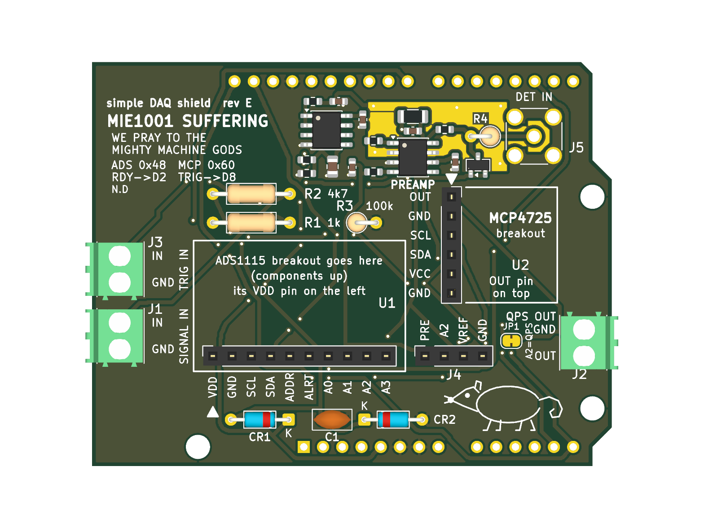
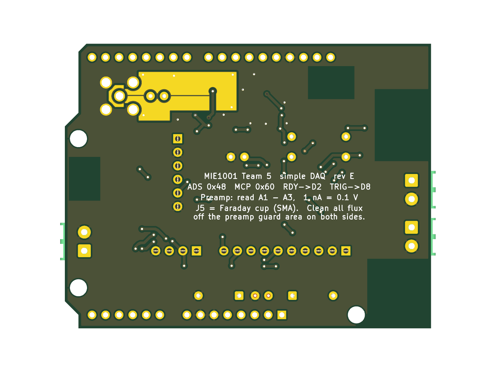

# MIE1001 — simple DAQ shield (rev E)

The beginner version of the DAQ board: an Arduino UNO R3 shield that the two breakout
boards from class plug into (modular: both unplug). Fat tracks, the breakouts, connectors and
through-hole parts are hand-soldered. **Rev D adds a Faraday-cup preamp** with 16 small SMD parts.
**Everything is ordered from Digi-Key** (university procurement, see [Ordering from Digi-Key](#ordering-from-digi-key))
**and hand-soldered** (see [Hand-soldering order](#hand-soldering-order)); JLCPCB assembly is an optional alternative.




```
SIGNAL IN (J1) -> R2 4k7 -> [CR1/CR2 clamp, C1 filter] -> ADS1115 breakout A0 -> I2C -> UNO -> USB -> laptop
UNO -> I2C -> SparkFun MCP4725 breakout OUT -> QPS OUT (J2), 0-5 V  (JP1, bridged: also -> ADS1115 A2 read-back)
TRIG IN (J3) -> R1 1k -> UNO D8 (R3 100k to GND)    ADS1115 ALRT -> UNO D2
Faraday cup -> J5 SMA -> R4 10k -> CR3 clamp to VREF -> R5 1k -> U3 LMP7721 preamp (R6 100M || C2 10p)
            -> R11/C6 1k/1u -> ADS1115 A1 (PRE_OUT)      VREF 2.5 V (R8/R9 100k/100k + C4 -> U4A MCP6002 -> R10 -> C5) -> A3
J4 = test header: 1 PRE_OUT, 2 A2 (QPS read-back while JP1 is bridged), 3 VREF, 4 GND
I2C: UNO SDA/SCL header pins AND A4/A5 (rev E)
```

| Check | Result |
|---|---|
| ERC | 0 errors, 0 warnings |
| Guard check (`check_guard.py`, rev E) | PASS: 0 items of any other net within 1.0 mm of the preamp input (COAX_IN, DET_IN, TIA_IN, TIA_REF), every input item has guard copper within 0.6 mm, and the bare-board flood fill from the input reaches only VREF and TIA_OUT on F.Cu and only VREF on B.Cu. The same script FAILS on the rev D board (7 leakage paths), so it catches the rev D defect |
| Independent critical review | Two reviews against the Adafruit, SparkFun, Arduino, Phoenix and TI source files and datasheets. Rev A: pinouts and UNO geometry correct, four fixes → rev B. Rev C: copper clean, no respin needed; one wrong BOM part number and several wrong claims in this file, all corrected below |
| Host board | Arduino UNO R3 **SMD** (ATmega328P in a flat TQFP-32 package). Its headers are identical to the standard R3 (same positions, same pins, SDA/SCL next to AREF), so the shield fits unchanged |
| Still unverified | The height of the parts on the UNO under the shield (crystal, USB chip, capacitors). The SMD chip itself is only about 1.2 mm tall, so this is much less of a risk than with the socketed DIP chip, but look at your board before soldering |
| DRC incl. schematic parity | 0 errors, 0 unconnected, 0 parity issues (4 `lib_footprint_mismatch` warnings: ARD1 and J1–J3 are deliberately modified copies) — rev E |
| Orientation | Same real-UNO geometry as the full board (rev E): flipped library footprint, keep-outs over the USB, DC jack and both ICSP headers |
| Rules | 0.5 mm tracks, ≥ 0.3 mm gaps, 0.8/0.4 mm vias: far above the Digi-Key PCB Builder (5 mil / 8 mil) and JLCPCB minimums |

## What changed in rev E (2026-09-25)

An independent review of rev D found a leakage path and a few smaller problems. **No connector,
socket or mounting hole moved** (J1–J5, the two breakout sockets, H1–H3 are where they were in rev D).
The router re-laid most of the signal tracks because the obstacles changed; that does not matter
electrically, DRC and the guard check are clean.

- **Guard closed under U3.** In rev D the guard pour stopped halfway under the LMP7721, and TIA_OUT
  ran from the feedback parts under the chip body to pin 4. The copper-free gap alongside it was a
  bare-board path from the input to GND (pin 3) and +5V (pin 6). Now a VREF bar runs under the
  chip from pin 2 to pin 7 (both N/C pins, on the guard), so the input pins 1 and 8 sit in a closed
  guard pocket, and TIA_OUT leaves the guard on the **bottom layer only**: via next to R6/C2, under
  the chip, via below the bar, then to pin 4 and R11. On the top layer the input is now completely
  surrounded by guard copper; the only other net it faces is TIA_OUT across C2 and R6 themselves,
  which only adds in parallel with the feedback resistor (TI LMP7721 datasheet, 10.1).
  DET_IN was re-laid as two straight runs so the guard hugs it everywhere.
- **No solder mask on the guard (both layers).** The mask openings are the guard pour shrunk by
  0.10 mm and kept ≥ 0.50 mm from any pad and ≥ 0.40 mm from any track of another net, and off all
  silkscreen. So every other track, every gap next to the guard and the edge of the GND pour stay
  under mask: exposed guard copper is never closer than 0.4 mm (mask web) to exposed copper of
  another net, which keeps solder bridges unlikely. Care points: the SMA J5 ground pins sit next to
  the bare guard ring around the centre pin (≥ 0.5 mm mask web); don't flood them with solder, and
  check there is no bridge from a J5 ground pin to the ring before powering up.
- **`check_guard.py` is strict now.** It fails (exit 1) on any unguarded input item (it used to only
  print them) and adds a bare-board flood fill from the input nets on each copper layer: reaching
  copper of any net other than VREF / TIA_OUT, or leaving the guard area, fails the build.
  `check_guard.py .history/revD-final/mie1001_daq_simple.kicad_pcb` shows the rev D failure.
- **Quieter VREF.** R8/R9 are now 100k/100k (were 10k/10k). With C4 10 µF the divider's corner is
  0.32 Hz instead of 3.2 Hz, so 50 Hz ripple on the USB 5 V reaches VREF attenuated ~160× instead
  of ~16×. The MCP6002's ~1 pA input bias current makes no measurable error through 50k.
- **A4/A5 also carry SDA/SCL.** On a genuine UNO R3 they are the same signals as the SDA/SCL pins
  next to AREF; some clones don't have those two pins, and then the shield works through A4/A5.
  Consequence: **never use A4/A5 as analog inputs** with this shield fitted.
- **JP1, QPS read-back.** A solder jumper, bridged by a copper strip from the factory, connects
  QPS OUT (MCP4725 OUT, J2) to ADS1115 **A2** (J4 pin 2). The firmware can read the command voltage
  it actually set: `ads.readADC_SingleEnded(2)`, with the ±6.144 V range
  (`ads.setGain(GAIN_TWOTHIRDS)`), because 0–5 V does not fit the ±4.096 V range. To use A2 for something else, cut the thin copper
  bridge between JP1's pads with a knife (check with a meter); a blob of solder closes it again.
  JP1 is next to J4, marked "JP1 / A2=QPS".
- **C5/C6 part (optional JLC route only).** LCSC C15849 had no LCSC stock; now C5673 (Samsung CL10A105KA8NNNC, 1 µF 25 V X5R
  0603, extended part: one extra JLC loading fee). There is no other *basic* 1 µF 0603 at JLC;
  JLC's own library still listed C15849 in stock on 2026-09-25, so it is a valid fallback.
- **Docs:** J4 firmware note rewritten (pins 1 and 3 are op-amp outputs), wrong 8 SPS/mains claim
  corrected, comparison with the full board corrected, U3 "no solder mask" note is now true.

## What changed in rev D (2026-09-24): the preamp

The Faraday cup gives a current of pA to nA. The ADS1115 measures voltage, so rev D adds a
**transimpedance amplifier** (U3, LMP7721) that turns 1 nA into 0.1 V. Everything that was on rev C
stays where it was; the preamp sits in the band under the digital header, where the text used to be
(the text moved to the left edge and the back).

| Part | Job |
|---|---|
| **J5** SMA jack (vertical, PTFE) | Detector input. Use a **BNC-female to SMA-male adapter** for a BNC cable. A BNC did not fit anywhere on this board |
| **U3** LMP7721 + **R6** 100 MΩ | The preamp: Vout = VREF − I × 100 MΩ. Full scale ~25 nA; 1 ADC count = 1.25 pA at GAIN_ONE |
| **C2** 10 pF | Stops the preamp oscillating with the cable capacitance. Sets a 159 Hz bandwidth |
| **R4** 10k + **CR3** BAV199 + **R5** 1k | Protect U3 from a discharge on the cable. CR3 is tied to VREF, so it leaks ~0 into the input |
| **VREF** 2.5 V: R8/R9 100k/100k (rev E), C4 10 µF, U4A MCP6002, R10 100 Ω, C5 1 µF | The input sits at 2.5 V so the output can swing both ways on a single 5 V supply |
| **R7** 1k | Protects U3's + input |
| **R11** 1k + **C6** 1 µF | 159 Hz anti-alias filter before ADS1115 **A1** |
| **Guard ring** (copper at VREF, both layers, no solder mask) | Surrounds the whole input so no other copper can leak pA into it; closed under U3 between pins 2 and 7 (rev E) |

**Firmware:** read the preamp as `ads.readADC_Differential_1_3()` (A1 − A3 = PRE_OUT − VREF), then
`I = −V / 100e6`. The ADS1115 only offers the pairs 0-1, 0-3, 1-3 and 2-3, which is why VREF is on A3.
SIGNAL IN (J1) → A0 still works as before for a voltage input.

**J4 changed:** pin 1 is now PRE_OUT and pin 3 is VREF (monitor only: connect a meter or scope, never a
source). Pin 2 (A2) carries the QPS read-back while JP1 is bridged (rev E); cut JP1 to use it as a free input.

**Still 0-5 V on QPS OUT.** The Extrel 150-QC wants a 0-10 V mass command; that needs a gain-2 amplifier on
a supply above 10 V (e.g. a 12 V adapter on the UNO's DC jack). Not on this revision.

**Handling:** the input works at picoamps. After soldering, wash off **all** flux around U3, R6, C2, R4 and
J5 (isopropyl alcohol, then dry), handle the board by its edges, and measure the zero offset with the
cable connected and the beam off before every scan.

## Names on the drawing and the board (2026-09-24, copper unchanged)

- The UNO is **ARD1** and the clamp diodes are **CR1, CR2** (were A1, D1, D2), so the names no longer clash
  with the UNO's pins A1 and D2.
- The UNO symbol shows only the pin names printed on the UNO (D2, D8, SDA ...), not KiCad pad numbers.
- SDA/A4 and SCL/A5 are the same signals on the UNO R3. Since rev E the shield connects A4/A5 as well
  (for clones without the SDA/SCL pins), so never use A4 and A5 as analog inputs.

## What changed in rev C

Three parts on the signal input, in the free band under the ADS1115 socket:

- **C1 (100 nF) to ground.** With R2 it is a single-pole low-pass at **339 Hz**, and it supplies the
  charge the ADC's switched-capacitor input takes at each sample. It takes the edge off fast noise
  and limits the bandwidth, so leave it out if you need to measure something faster than ~300 Hz.
  **It does not remove mains hum**: at 50 Hz it attenuates by only 1.1 %. See the firmware notes for
  what actually works. **C1 must be X7R or C0G, not Y5V** (a Y5V part loses most of its value when
  warm, which moves the corner frequency anywhere up to ~2 kHz).
- **CR1 and CR2 (1N4148) clamps.** They divert most of an over-voltage to the rails. Be clear about
  what does the work: **R2 is what keeps the chip legal** (1.3–2.4 mA at ±12 V against its 10 mA
  limit), because the 1N4148 only starts conducting around 0.5–0.7 V, by which point the input is
  already past the ADC's absolute maximum of VDD + 0.3 V and the chip's own internal protection
  diode is conducting alongside CR1. The diodes are there for the energy of a static zap or a badly
  wrong connection, not to hold the pin inside spec. TI also warns that overdriving one input can
  upset conversions on the others: **while A0 is overdriven, readings on A1–A3 are not valid either.**
- **What the diodes cost:** up to 25 nA of leakage each, which through R2 is up to 117 µV of offset
  (15 counts at GAIN_SIXTEEN, and several times worse when hot). Fine at low gain; calibrate the
  offset if you use the high gain ranges.
- **One side effect:** with the Uno unpowered, a signal above 5 V feeds up to 2.4 mA (at +12 V) back into its
  5 V rail through CR1. Don't leave a live preamp connected to an unpowered board.
- **No amplifier.** The ADS1115 has a programmable gain amplifier built in, so a small signal is
  handled in software with `ads.setGain(...)` instead of another chip. Note that at the highest
  gains the chip's differential input resistance falls to about 710 k, where R2 costs ~0.66 % of
  gain (under 0.1 % at the ±6.144 V range, 0.2–0.4 % at ±2.048 and ±1.024 V): calibrate if you use GAIN_SIXTEEN. Note TI suggests keeping
  a filter resistor under 1 k; 4.7 k is deliberate here, chosen for protection, and C1 at the pin
  supplies the sampling charge that the series resistance otherwise would.

**Watch the stripe when soldering the diodes.** The silkscreen prints **K** at the cathode end of
each one, and that is the end with the black band on the part. CR1's K points right, towards +5 V.
CR2's K points left, towards the signal. Backwards, they short the signal to a rail.

## What changed in rev B

- **R2 (4k7) in series with SIGNAL IN.** The ADS1115 input may not go above VDD + 0.3 V (TI
  datasheet, absolute maximum ratings). If the preamp swings to its ±12 V rails, R2 keeps the current
  into the chip's input clamp to 1.3–2.4 mA (its limit is 10 mA). Gain error: under 0.1 % on the ±6.144 V
  range, 0.66 % on the ±0.256 V range.
- **R3 (100k) pull-down on D8.** A TRIG IN with nothing connected now reads LOW instead of
  picking up noise and giving false triggers.
- **Pin-1 triangles and "which way round" text on both sockets.** Both breakouts fit in their
  sockets rotated 180°. For the MCP4725 that puts 5 V on its GND pin. Now the MCP4725 outline is
  the real 15.2 × 15.2 mm board.
- **Firmware and BOM fixes.** `dac.begin(0x60)` (the library default is 0x62), and the BOM no
  longer orders the new two-row ADS1115 board that doesn't fit.

## Before you order: three things to check by hand

1. **Which ADS1115 board do you have?** Use the one from the class kit; do not order a new one. This shield fits the **original** Adafruit board with
   **one row of 10 pins** (VDD GND SCL SDA ADDR ALRT A0 A1 A2 A3). Adafruit now sells a newer
   STEMMA QT version (two rows of 6, "VIN" instead of "VDD") under the same product number
   1085, and **it does not fit**. Your team's self-test sketch says "VDD", so you probably have
   the original, but count the pins.
2. **Print `fab/print_1to1_top.pdf` at 100 %** and lay the UNO and both breakouts on it. The
   header holes must line up with the UNO's pins and with each breakout's pins.
3. **Height over the UNO's chip area.** CR1, CR2, C1, the ADS1115 socket and J4 all sit above it.
   On the UNO R3 SMD the ATmega328P is a flat TQFP (about 1.2 mm), so the chip itself is no problem;
   check that nothing else on your board (crystal, USB chip, capacitors) is taller than the gap, and
   trim the leads flush.

## Parts (full list in `BOM.csv`)

| Ref | Part | Where |
|---|---|---|
| U1 | Adafruit ADS1115 breakout (original, 1×10), **from the class kit** | plugs into a 1×10 female header (Sullins PPTC101LFBN-RC, Digi-Key S7008-ND). Don't order 1528-1085-ND: that is the new two-row board |
| U2 | SparkFun MCP4725 breakout BOB-12918 | plugs into a 1×6 female header (PPTC061LFBN-RC, S7004-ND). Retired at SparkFun, still Active at Digi-Key 1568-12918-ND (656 in stock on 2026-09-25). If it is gone, use the class-kit board: Adafruit's MCP4725 breakout is **not** pin-compatible (VIN/GND/SCL/SDA/A0/VOUT, no second GND) |
| J1, J2, J3 | Phoenix 1984617 screw terminals, 3.5 mm | Digi-Key 277-1721-ND |
| J4 | 1×4 female header for the spare inputs | S7002-ND |
| R1 | 1k ¼ W resistor on the trigger | 1.0KQBK-ND |
| R2 | 4k7 ¼ W resistor in series with SIGNAL IN | 13-CFR-25JB-52-4K7-ND |
| R3 | 100k ¼ W pull-down on D8, mounted standing up | 13-CFR-25JB-52-100K-ND |
| C1 | 100 nF 50 V **X7R** disc, **2.5 mm lead pitch** (not Y5V: BC1160-ND is the wrong one) | BC1084CT-ND |
| CR1, CR2 | 1N4148 signal diodes (DO-35) | 1N4148FS-ND |
| — | UNO stacking headers (1×10, 2× 1×8, 1×6, 10.5 mm legs) | Adafruit 85, Digi-Key **1528-1074-ND** (legs just clear the USB jack) |
| U3, U4, CR3, R5–R11, C2–C7, J5, R4 | the preamp | all Digi-Key, see `BOM.csv` / `fab/digikey_bom.csv` |

No other parts. Both breakouts already carry the I²C pull-ups: the ADS1115 board has 10k on
SDA and on SCL (hard-wired), the MCP4725 board has 4.7k on each through jumper SJ1 (closed by a
trace from the factory). In parallel that is 3.2k per line, about 2.9k once the Arduino's own
internal pull-ups are counted, which draws 1.6 mA at the low level against the 3 mA an I²C
device must sink. The minimum sensible value here is about 1.5k, so this is fine and the shield
adds no pull-ups of its own. If you ever chain more I²C boards onto this one, each brings its own
pull-ups and the total drops: cut SJ1 on the MCP4725 board to take its 4.7k pair off the bus.
The ADS1115 breakout also pulls ALRT (UNO pin D2) up with 10k.

## Ordering from Digi-Key

Everything is bought from Digi-Key (university procurement). Checked on digikey.com on **2026-09-25**:
every part number below exists, matches the MPN and package in `BOM.csv`, is **Active** and is in stock.

### Parts: `fab/digikey_bom.csv`

`./build.sh` writes `fab/digikey_bom.csv` in Digi-Key's **BOM Manager / "Upload a list"** format
(`Digi-Key Part Number, Manufacturer Part Number, Manufacturer, Quantity, Customer Reference`), 24 lines,
**quantities for ONE board**. Not in it (do not order): the UNO (ARD1) and the ADS1115 breakout (U1),
both from the class kit. Upload it, then set the quantities you want (below).

| Ref | Digi-Key P/N | MPN | Stock 2026-09-25 | Unit price (USD, qty for 1 board) |
|---|---|---|---|---|
| C1 | BC1084CT-ND | Vishay K104K15X7RF5TL2 | 209,208 | 0.29 |
| C2 | 1276-1027-1-ND | Samsung CL10C100JB8NNNC | 289,398 | 0.10 |
| C3, C7 | 732-8013-1-ND | Würth 885012206095 | 508,777 | 0.10 |
| C4 | 587-4334-1-ND | Taiyo Yuden TMK212BBJ106KGHT | 13,242 | 0.29 |
| C5, C6 | 1276-1102-1-ND | Samsung CL10A105KA8NNNC | 734 | 0.10 |
| CR1, CR2 | 1N4148FS-ND | onsemi 1N4148 | 663,443 | 0.10 |
| CR3 | BAV199LT1GOSCT-ND | onsemi BAV199LT1G | 290,353 | 0.16 |
| J1–J3 | 277-1721-ND | Phoenix 1984617 | 44,569 | 0.59 |
| J4 | S7002-ND | Sullins PPTC041LFBN-RC | 46,150 | 0.42 |
| J5 | ACX1230-ND | Amphenol RF 132134 | 23,380 | 9.98 |
| R1 | 1.0KQBK-ND | YAGEO CFR-25JB-52-1K | 200,942 | 0.10 |
| R2 | 13-CFR-25JB-52-4K7-ND | YAGEO CFR-25JB-52-4K7 | 109,075 | 0.10 |
| R3 | 13-CFR-25JB-52-100K-ND | YAGEO CFR-25JB-52-100K | 92,597 | 0.11 |
| R4 | 13-CFR-25JB-52-10K-ND | YAGEO CFR-25JB-52-10K | 148,616 | 0.10 |
| R5, R7, R11 | 311-1.00KHRCT-ND | YAGEO RC0603FR-071KL | 3,768,097 | 0.10 |
| R6 | HVCB1206FKC100MCT-ND | Stackpole HVCB1206FKC100M | 19,674 | 4.01 |
| R8, R9 | 311-100KHRCT-ND | YAGEO RC0603FR-07100KL | 916,017 | 0.10 |
| R10 | 311-100HRCT-ND | YAGEO RC0603FR-07100RL | 260,261 | 0.10 |
| U2 | 1568-12918-ND | SparkFun 12918 (BOB-12918) | 656 | 6.95 |
| U3 | LMP7721MA/NOPB-ND | TI LMP7721MA/NOPB | 2,191 | 7.34 |
| U4 | MCP6002-I/SN-ND | Microchip MCP6002-I/SN | 11,665 | 0.42 |
| X1 | S7008-ND | Sullins PPTC101LFBN-RC | 24,605 | 0.64 |
| X2 | S7004-ND | Sullins PPTC061LFBN-RC | 30,030 | 0.47 |
| stacking headers | 1528-1074-ND | Adafruit 85 | 814 | 1.95 |

**Changed on 2026-09-25 for Digi-Key:** C2 (Murata GRM1885C1H100JA01D is *Not For New Designs*) → Samsung
CL10C100JB8NNNC, same 10 pF C0G 50 V 0603. C3/C7 (Samsung CL10B104KB8NNNC, 0 in stock, 61-week lead
time) → Würth 885012206095, same 100 nF X7R 50 V 0603. C4 (Samsung CL21A106KAYNNNE, 0 in stock) → Taiyo
Yuden TMK212BBJ106KGHT, same 10 µF X5R 25 V 0805 (1.35 mm max height). R4: the old number 10KQBK-ND no longer
shows up at Digi-Key; same Yageo part under 13-CFR-25JB-52-10K-ND. The `LCSC` column in `BOM.csv` is only for
the optional JLC route and may name an equivalent part (R6: Uniroyal), not the Digi-Key MPN.

**Watch before ordering:** C5/C6 had only 734 in stock (2 needed); if it has run out, any 1 µF ≥ 16 V X5R/X7R 0603 will do. The LMP7721 has **no pin-compatible substitute**: if LMP7721MA/NOPB-ND is gone, LMP7721MAX/NOPB is
the same part on a reel (drop-in; check whether Digi-Key sells it as cut tape); anything else (e.g. ADA4530-1,
LMC6001) has a different pinout/package and means a PCB respin.

**Cost** (Digi-Key qty-1 prices, USD, parts only, excl. PCB, shipping and VAT): **1 board $36.40,
2 boards $72.80** (Teams 4+5 may want a spare). The two biggest items are J5 SMA ($9.98) and U3 ($7.34).

**Recommended spares** (cheap, and small parts get lost or damaged in hand-soldering):
- 0603/0805 passives and CR3: order **10 of each line** instead of 1–3 (price per piece drops to $0.03,
  so 10 cost about the same as 3–4), i.e. +20–50 % is the minimum.
- 1 extra LMP7721 ($7.34): it is the critical, ESD-sensitive part; 1 extra R6 ($4.01): it is easy to
  contaminate. 1 extra MCP6002, +2 of each THT resistor and 1N4148, +1 C1.
- For 2 boards plus these spares: **about $87**.

### The bare PCB: DigiKey PCB Builder

Digi-Key does not make or assemble boards itself; its **PCB Builder** (digikey.com/en/pcb-builder, needs a
My DigiKey login to check out) uploads your files and shows live offers from partner board houses, which ship
directly to you: **DKRed** (Digi-Key's own budget programme, built in Hollister CA), Summit Interconnect,
Advanced Circuits and Precision PCBs.

- **Files:** upload `fab/mie1001_daq_simple_gerbers.zip` (RS-274X Gerbers + Excellon drill, < 10 MB).
  Digi-Key requires at least 2 copper layers, a drill file, 2 solder-mask layers and an outline; the zip
  has all of them (F/B_Cu, F/B_Mask, F/B_Silkscreen, Edge_Cuts, PTH + NPTH drill). Digi-Key's FAQ lists
  extensions such as .gts/.gto/.drl/.gko and does not name KiCad's `.gtl/.gbl/.gm1`: check the viewer
  and assign top copper = `.gtl`, bottom copper = `.gbl`, outline = `.gm1` by hand if it guesses wrong.
  F_Paste and the `.gbrjob` are not needed (no stencil: hand-soldered).
- **Capabilities vs this board (checked from the .kicad_pcb, not just the rules):**

  | | this board | DKRed | Advanced Circuits / Summit / Precision |
  |---|---|---|---|
  | layers, thickness | 2, 1.6 mm FR4 | 2 or 4, 0.062" (1.6 mm) FR4 Tg170 | 2/4/6, 0.031/0.062/0.093" |
  | min track / space | 0.5 mm / ≥ 0.3 mm (DRC min), zone min width 0.2 mm | 5 mil (0.13 mm) | 5, 6 or 8 mil |
  | min drill | 0.4 mm (vias) | 8 mil (0.20 mm) | 8, 11 or 12 mil |
  | annular ring | ≥ 0.2 mm (vias 0.8/0.4), ≥ 0.27 mm pads | ≥ 3 mil | – |
  | board size | 68.58 × 53.34 mm (2.70 × 2.10 in) | 0.5–10 in | AC 0.75–10 in, Summit 2–16 × 2–22 in, Precision 1–18 in |
  | finish / mask | guard copper deliberately without mask | **ENIG only**, red mask, white silk | HASL (leaded or lead-free) or ENIG; green/black/red/blue/purple/clear mask |

  **Nothing fails**: every rule has ≥ 2× margin. The unmasked guard ring is just openings in the
  F/B_Mask Gerbers, which every house reproduces; the mask web between the bare guard and any other copper
  is ≥ 0.4 mm. ENIG (DKRed's only option) is the better finish here anyway: flat pads for the SOIC/0603 parts and
  gold on the exposed guard copper. If you pick another house, choose ENIG or lead-free HASL.
- **Price:** DKRed is $1.50 per square inch per board, **minimum 4 boards**: 5.67 in² → $8.50/board,
  **$34 for 4** (you cannot order just 3; 4 is the cheapest option). Build time 10 business days (5 quick-turn).
  The other houses quote live after the upload (not published; typically more). DKRed ships free only within
  the US: shipping to the Netherlands, customs and VAT are extra: check the total at checkout before committing.

### Optional: JLCPCB instead

Only if procurement allows it. Upload the same gerber zip (2 layers, 1.6 mm, HASL or ENIG). To have JLC
assemble the SMD preamp parts, turn on PCB Assembly (top side) and upload `fab/jlcpcb_bom.csv` and
`fab/jlcpcb_cpl.csv` (16 parts, 11 lines, from the `LCSC` column); check U3/U4/CR3 rotation in JLC's preview
and that the LCSC parts are in stock. Then solder only the THT steps below.

## Hand-soldering order

Nothing is assembled by the board house. Work on an ESD mat with a grounded wrist strap, fine tip
(≤ 1 mm chisel), 0.5 mm solder, flux pen, fine tweezers and a magnifier. Solder **all SMD parts first**,
while the board still lies flat, then the THT parts from lowest to tallest.

1. [ ] **U4 MCP6002 (SOIC-8)**: tack one corner pin, check pin 1 (dot) and alignment, solder the opposite
   corner, then the rest. Remove any bridge with wick.
2. [ ] **U3 LMP7721 (SOIC-8)**: **ESD-sensitive** (wrist strap; leave it in its bag until needed), pin 1 at the
   dot. Pins 1 and 8 sit in the bare guard pocket: use little solder, no bridge to the guard copper.
3. [ ] **CR3 BAV199 (SOT-23)**: small; tack the single pin first, then the two others.
4. [ ] **0603 parts**: R5, R7, R11 (1k), R8, R9 (100k), R10 (100R), C2 (10 pF, unmarked: keep it apart
   from the other caps), C3, C7 (100 nF), C5, C6 (1 µF). Ceramic caps are unmarked: open one tape at a time.
5. [ ] **0805 C4** (10 µF) and **1206 R6** (100 MΩ; don't touch the resistor body with bare fingers).
6. [ ] **Clean the preamp area now**: scrub U3, R6, C2, R4/CR3 and the guard ring with IPA (≥ 99 %) and a
   clean brush, rinse with fresh IPA, let it dry fully (heat gun on low / 30 min). **Critical for the pA
   input:** any flux residue across the guard is a leakage path.
7. [ ] THT, lowest first: CR1, CR2 (lying flat, **stripe towards the K**), R1, R2 (flat), C1, R3 and R4
   (standing, body on the circle).
8. [ ] **J5 SMA**: the four ground legs are on the GND pour and soak heat: use a larger tip / higher
   temperature (~370 °C) and let the solder flow through; the centre pin sits in the bare VREF guard ring:
   no solder bridge from a ground leg to the ring (check with a meter).
9. [ ] Female headers X1 (1×10), X2 (1×6), J4 (plug the breakout in while soldering so they stay straight),
   terminal blocks J1–J3, then the stacking headers (last: tallest).
10. [ ] **Trim every lead under the board flush. This is required, not optional.** The ADS1115 socket
   and J4 sit right above the UNO's ATmega chip, and CR1, CR2 and C1 are in the same band. An untrimmed
   socket lead sticks out about 1.6 mm and a terminal pin about 2.9 mm. Check the clearance over the rest
   of that area with the real boards before you solder everything down.
11. [ ] Clean the whole board (IPA) once more around J5 and the guard ring; handle the board by its edges.
12. [ ] Plug the breakouts in **component side up**, matching the pin names on the breakout to the names on
   the shield: VDD on the left for the ADS1115, and OUT at the top (at the ▼) for the MCP4725. Rotated
   180° the MCP4725 gets 5 V on its GND pin.

**Hard to hand-solder:** the 0603 parts (small, unmarked caps: C2 mixed up with another cap ruins the
preamp's stability), CR3 (SOT-23), and J5 (ground legs on a big pour, next to the bare guard). U3 is easy to
solder but easy to kill with ESD and easy to spoil with flux: this is why it gets a spare. None of the parts
needs hot air or reflow.

## Firmware notes

- ADS1115 at **0x48**, MCP4725 at **0x60**. Libraries: Adafruit ADS1X15 and Adafruit MCP4725.
- **`dac.begin(0x60)`**: the Adafruit_MCP4725 library defaults to 0x62, so a plain `dac.begin()`
  finds nothing. `ads.begin()` (0x48) is correct as is.
- Read the signal on A0. `ads.setGain(GAIN_TWOTHIRDS)` gives ±6.144 V full scale. For a small
  signal turn the gain up instead of adding an amplifier: `GAIN_SIXTEEN` gives ±0.256 V full scale
  and ~7.8 µV steps.
- **The input is filtered at 339 Hz** (R2 with C1), so the board cannot follow anything faster.
  Leave C1 out if you need the bandwidth.
- **For 50 Hz mains hum, average in the sketch over whole 20 ms windows**, not over "a slow data
  rate". At 8 SPS one conversion takes 125 ms = 6.25 mains cycles, and the ADS1115's filter nulls
  sit at multiples of its data rate (8, 16, 24 Hz ...), not at 50 Hz, so 8 SPS does not by itself
  cancel hum. Instead take readings at a fixed rate that fits a whole number of times into 20 ms and
  average an integer number of 20 ms windows: e.g. 250 SPS (`RATE_ADS1115_250SPS`, 4 ms) and average
  5, 10, 50 ... consecutive readings (20, 40, 200 ms). Time the samples with the ALRT/RDY pin (D2),
  not with `delay()`. C1 barely touches 50 Hz. Measure the result with the input shorted.
- **J4 is a monitor header, not three spare inputs any more.** J4-1 is PRE_OUT (the preamp output via
  R11) and J4-3 is VREF (the MCP6002 output via R10): **never connect either to GND or to a source**,
  that shorts an op-amp output. Connect only a meter or scope. J4-2 is ADS1115 A2, which carries the
  QPS read-back while JP1 is bridged; only if you cut JP1 is it a free input, and then it has no
  resistor, clamp or filter: keep it within 0 V … VDD. Leaving A2 open is fine (the firmware just
  doesn't read it); there is nothing to tie down.
- **The useful input range is 0 V to VDD** (the USB 5 V, often only 4.8 V). This board expects a
  voltage from Team 3's preamp, not the raw detector current. R2 protects the chip from a preamp
  that overshoots, but readings above VDD are not valid.
- The MCP4725 powers up at mid-scale (2.5 V on QPS OUT). Write 0 to its EEPROM once.
- Trigger in: `pinMode(8, INPUT)`, active HIGH. R3 holds D8 low when nothing is connected. Use 5 V
  logic if you can: the ATmega needs 3.0 V for a HIGH, so 3.3 V logic (3.27 V at D8 after the R1/R3 divider) has under 0.3 V to spare.
  R1 limits the current if the trigger goes a little above 5 V. **Never feed it 12 V**: that pushes
  6.5 mA into the ATmega's input clamp, past its absolute maximum.
- ALRT goes to **UNO pin 2**: `pinMode(2, INPUT)` is enough, the breakout has the pull-up. (The diodes are named CR1 and CR2 and the UNO is ARD1, so "D2" and "A1" on this board
  always mean the UNO's pins.)

## Compared with the full board (`../mie1001_daq_board`, rev E)

Since rev D this board also has an electrometer preamp (U3 LMP7721, 100 MΩ, guarded input on J5), so
it can measure a Faraday-cup current directly, with a single fixed range (~25 nA full scale). SIGNAL IN
(J1) still digitises a voltage that someone else has made, with basic protection (R2, CR1/CR2) and a
339 Hz filter (R2, C1). The full board (`../mie1001_daq_board`) adds a jumper-selectable second
feedback range (2.2 MΩ / 100 MΩ); this one stays easy to build, with the breakouts from class plugged in.

## Files

`generate_schematic.py` and `generate_pcb.py` generate everything (the PCB script reuses the
UNO geometry and the router of the full board); `./build.sh` rebuilds and re-runs all checks.
The possum and the prayer to the machine gods are in `generate_pcb.py`, `possum()`.
